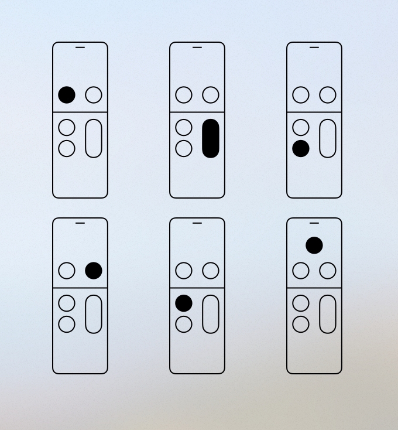

# SiriRemoteView

Simple View representing a Siri Remote device



## Description

SiriRemoteView is a subclass of UIView, which allow representing on the screen a Siri Remote Device on different status.

Customizable properties:

- lineColor: Color used to draw the shape line
- lineWidth: Width of the line
- hightlightColor: Color of the highlighted button
- highlightedButton: Optional, if present a Siri Remote key is highlighted


## Requirements

- tvOS 9.0+
- Xcode 8.2

## Usage

All you need is to create an instance of SiriRemoteView and add it on the screen:

```swift
let siriRemote = SiriRemoteView()
siriRemote.backgroundColor = .clear
siriRemote.lineColor = .black
siriRemote.hightlightColor = .black
siriRemote.highlightedButton = .menu

view.addSubview(siriRemote)
```
